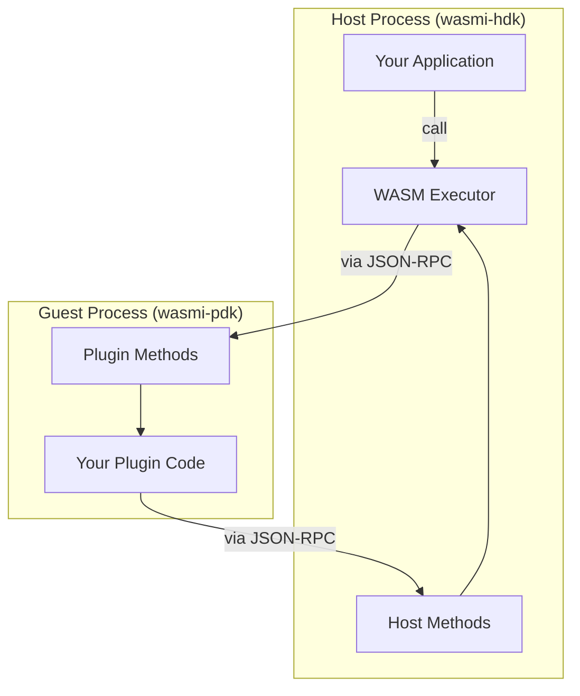

# Wasmi Plugin Framework

A plugin framework built on the [Wasmi](https://github.com/wasmi-labs/wasmi) WebAssembly interpreter. The Wasmi Plugin Framework is designed to run wasm plugins across many architectures, including natively, on mobile, and web browsers (running guest wasm32-wasip1 instances within wasm32-unknown-unknown!).

**Features**

-   Uses JSON-RPC over stdio for communication with host
    -   stdin / stdout for bidirectional JSON-RPC communication
    -   stderr for logs
-   Async compatible host & guest
-   Single-threaded compatible
-   Interpreter-based (works on IOS, thanks to wasmi)

**Limitations**

-   Plugins are stateless. Each host call made to a plugin is made to a new instance of that plugin. Data persistence must be handle by the host.
-   No multi-threading support for guests (wasi-wasip1 limitation)
-   No filesystem or network access access for guests

### wasm32-wasip1 Support

The Wasmi Plugin Framework intentionally targets a subset of the `wasm32-wasip1` spec to maximize compatibility across platforms. Because of this, some wasi syscalls are either not implemented or have limited functionality.

The following wasi syscalls are fully supported:
- `args_get`
- `args_sizes_get`
- `environ_get`
- `environ_sizes_get`
- `random_get`
- `sched_yield`
- `proc_raise`
- `proc_exit`

The following wasi syscalls are partially supported:
- `fd_read` - only supports reading from stdin (fd 0)
- `fd_write` - only supports writing to stdout (fd 1) and stderr (fd 2)
- `clock_time_get` - supports `CLOCKID_REALTIME` and `CLOCKID_MONOTONIC`
- `poll_oneoff` - supports only `clock` subscriptions

The remaining wasi syscalls are not supported. Because this framework is designed to run in wasm32-unknown-unknown environments (specifically web browsers), filesystem and network access would be mostly impossible anyways. If you need network or filesystem access for your plugin, consider implementing those features as host methods
instead.

**What this means:**

Most of the time unless you're deliberately trying to use an unsupported feature (ie using filesystem access, trying to spawn a thread, making network requests, etc), your plugin will work just fine. If you do try to use an unsupported feature, the plugin will likely panic and return an error to the host.

## Architecture

### How it works
- **Bidirectional RPC**: Host and plugin can call methods on each other via JSON-RPC over stdin/stdout
- **Cooperative execution**: Fuel-based yielding enables async operation in single-threaded environments
- **WASI subset**: Provides subset of wasi syscalls (stdio, time, random, yield, poll_oneoff) for plugin execution

## Examples

See the [host tests](./wasmi-hdk/tests/) and [test-plugin](./test-plugin/) for example usage.